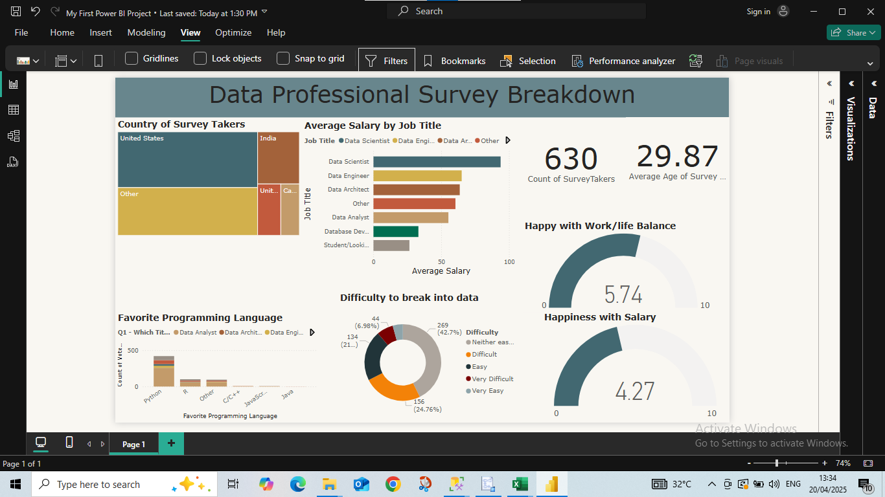
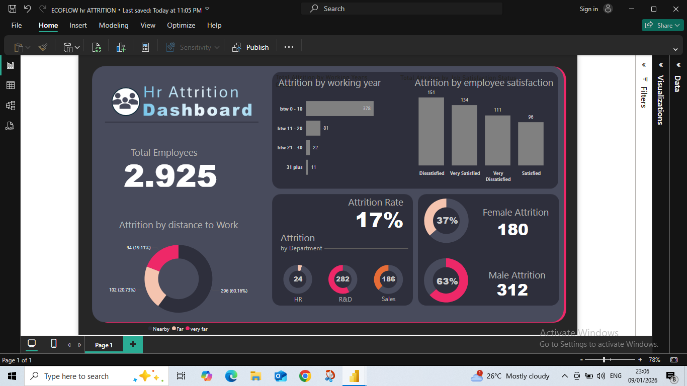
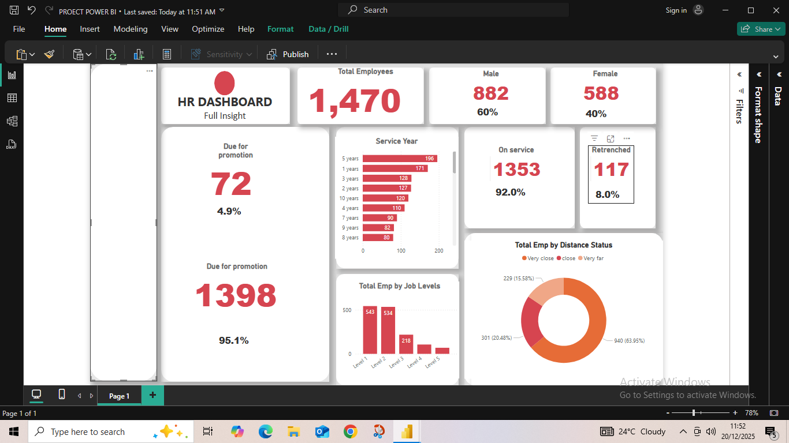

# 📊 Power BI Projects

This collection showcases my Power BI work, where raw data is transformed into clear, interactive dashboards that drive real business decisions.

Each project focuses on one thing: making complex data easy to understand, easy to explore, and impossible to ignore.

---

## 🚀 Projects

---

### 📈 Data Professional Survey Dashboard

What do data professionals actually earn? Which tools dominate the industry? Where are the real opportunities?

This dashboard answers those questions using survey data, breaking down salaries, roles, tools, and career trends into a clear visual story.

🔹 **Focus:** Salary trends, role distribution, tool usage  
🔹 **Tool:** Power BI  

👉 [View Full Project](Data_professional_survey/)

---

### 👥 HR Attrition Dashboard

Employee turnover is expensive. But understanding *why* it happens is where the real value lies.

This dashboard uncovers attrition patterns, highlights risk areas, and provides a clear view of workforce trends to support smarter HR decisions.

🔹 **Focus:** Attrition analysis, workforce insights  
🔹 **Tool:** Power BI  

👉 [View Full Project](hr_attrition_dashboard/)

---

### 🏢 HR Dashboard

A high-level HR dashboard designed to give decision-makers instant clarity on workforce structure, performance indicators, and organizational trends.

Clean. Focused. Actionable.

🔹 **Focus:** Workforce analytics, performance tracking  
🔹 **Tool:** Power BI  

👉 [View Full Project](hr_dashboard/)

---

## 🧠 Skills Demonstrated

- Turning raw data into clear visual narratives  
- Designing dashboards that highlight what matters most  
- Identifying trends, patterns, and business opportunities  
- Building interactive reports for better decision-making  
- Communicating insights in a simple, intuitive way  

---

## 📌 Final Note

Good dashboards don’t just show data.  
They guide decisions.

These projects reflect my ability to take messy, complex datasets and turn them into tools that people can actually use.
